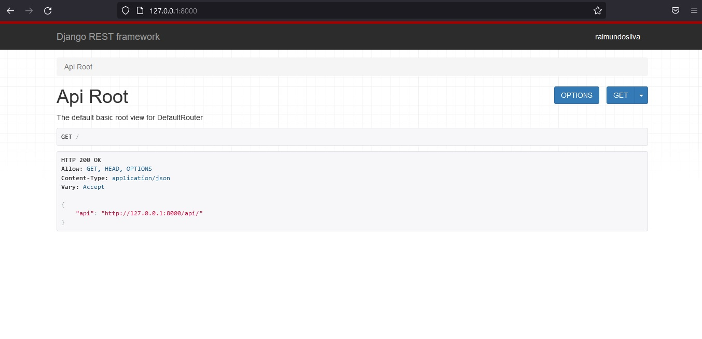
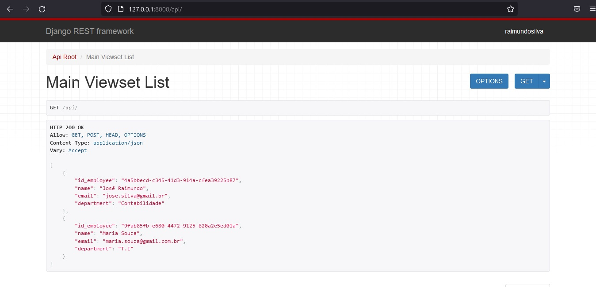
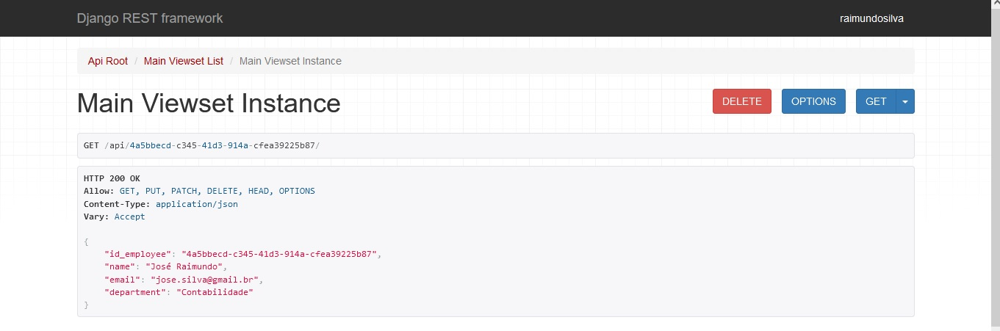
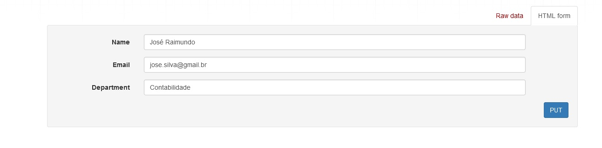
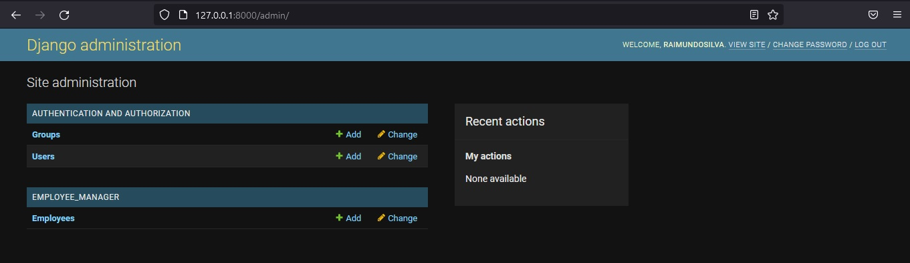

# Django IGS-Software Manager 

 Hi! This project was created as a test for IGS International Solutions
 
 The goal of this django application is:
 * A django admin panel to manage employee's data
 * A Django API to list, add and remove employees

 ## Install dependences

 In order to run the application it's required Python 3.9, django and djangorestframework
 
 ## Start application

 One can start the aplication by running the manage.py file

 ## Brief Tutorial
 
 ### API

 The app will automatically open the list of api's by defaut. There's no security on this app. It's just an api test as show on the image below.

 

To acess the employee api just click on the json link or include /api on the main address

On this page you can add new employees by **POST** method, and to show all current employees just click on **GET** and it will show a json with all data. If you want to use **DELETE** method or **PUT** mehod just include api/id_employee on the  main address.

### Admin panel

To use the admin panel it's required to go to admin route - you can do this by include /admin on the main address and use the following credentions:
* username: raimundosilva
* password: djangotest

#### Thanks for the support!!
